# CV Assignment-3

## Question 1) Part 2

overall

Modify Faster R-CNN for predicting Oriented Bounding Boxes

[train](train.py) 

[train_reg](train_reg.py) just chnage .yaml file, code automatically adapts to regression,classification. 

---

##  2.2 Extending Faster R-CNN for Oriented Bounding Boxes

### 1. Modify the code to predict oriented bounding boxes:   done

### 2. Adjust the evaluation metrics: done

### 3. Tune the hyperparameters of the model:

#### angle_binsize = 0 for regression 
#### angle_binsize > 0 integer for classification

-----------

#### Regression over angle
[train_1](train_1.py)
  angle_weight : .1
  angle_binsize : 0
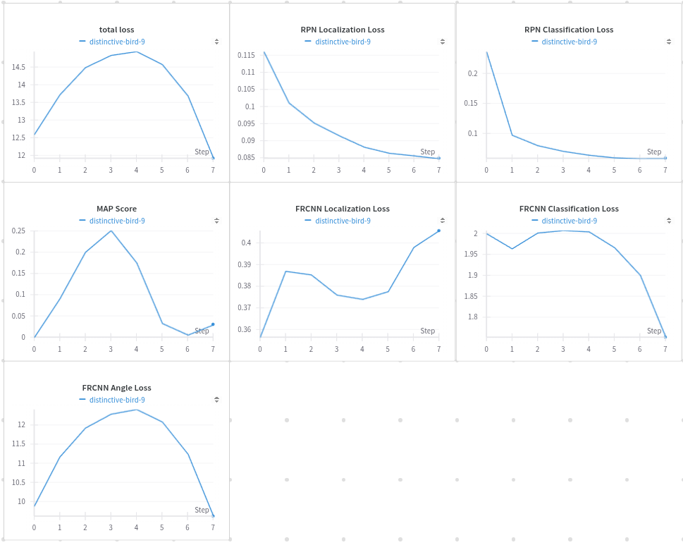
[CSV](hyperparameter_CSV/st_1.csv)

[train_2](train_2.py)
  angle_weight : 1
  angle_binsize : 0
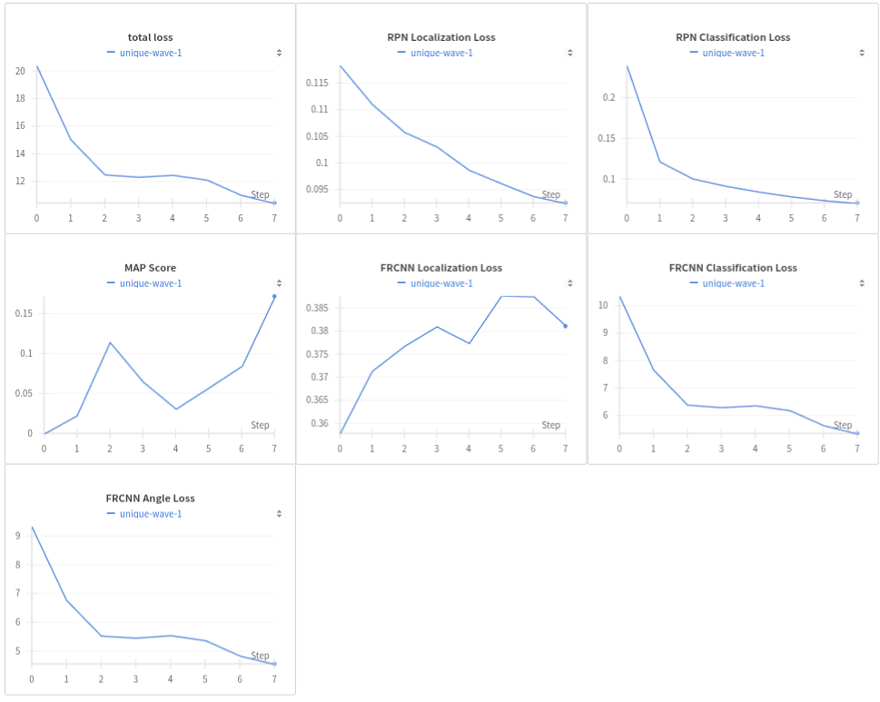
[CSV](hyperparameter_CSV/st_2.csv)

[train_3](train_3.py)
  angle_weight : 10
  angle_binsize : 0
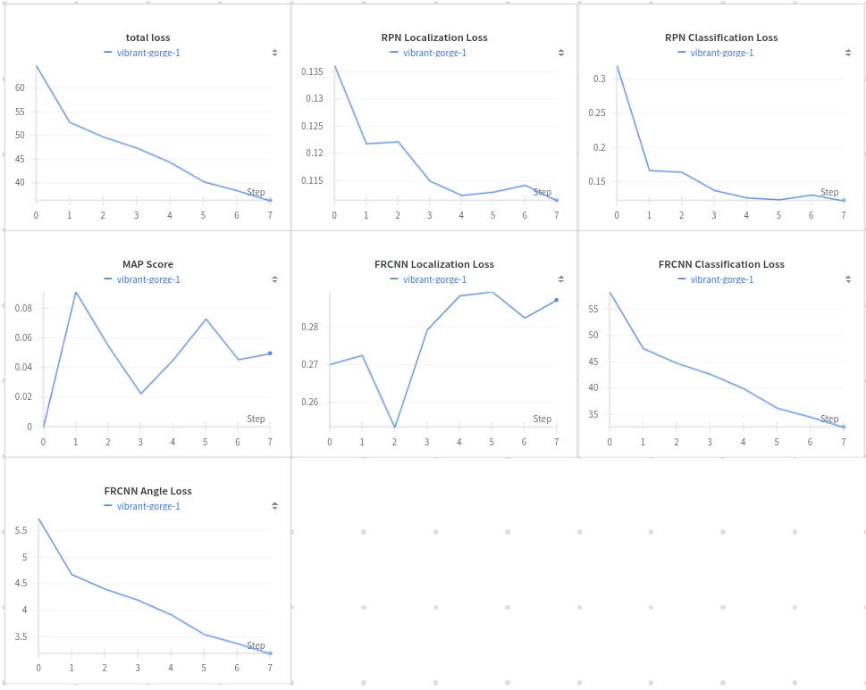
[CSV](hyperparameter_CSV/st_3.csv)

---
#### Classification over discretized angles

[train_4](train_4.py)
  angle_weight : 0.1
  angle_binsize : 10
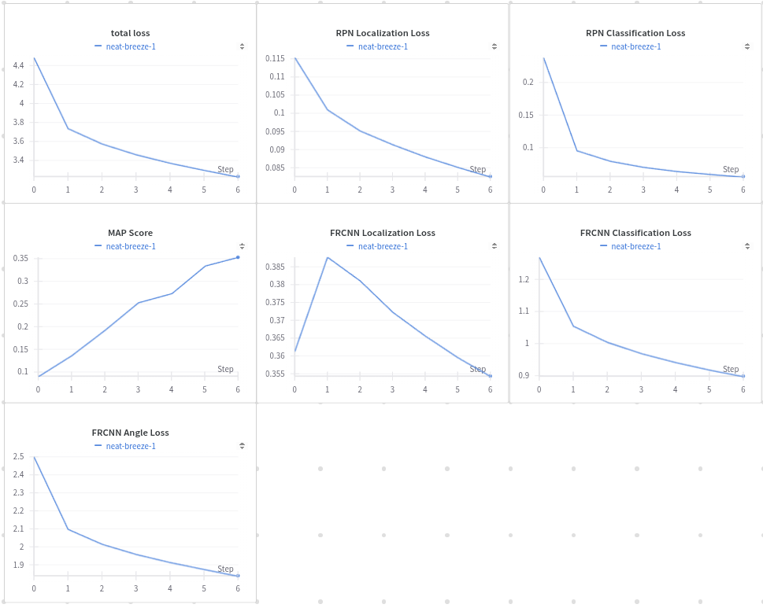
[CSV](hyperparameter_CSV/st_4.csv)

[train_5](train_5.py)
  angle_weight : 1
  angle_binsize : 10
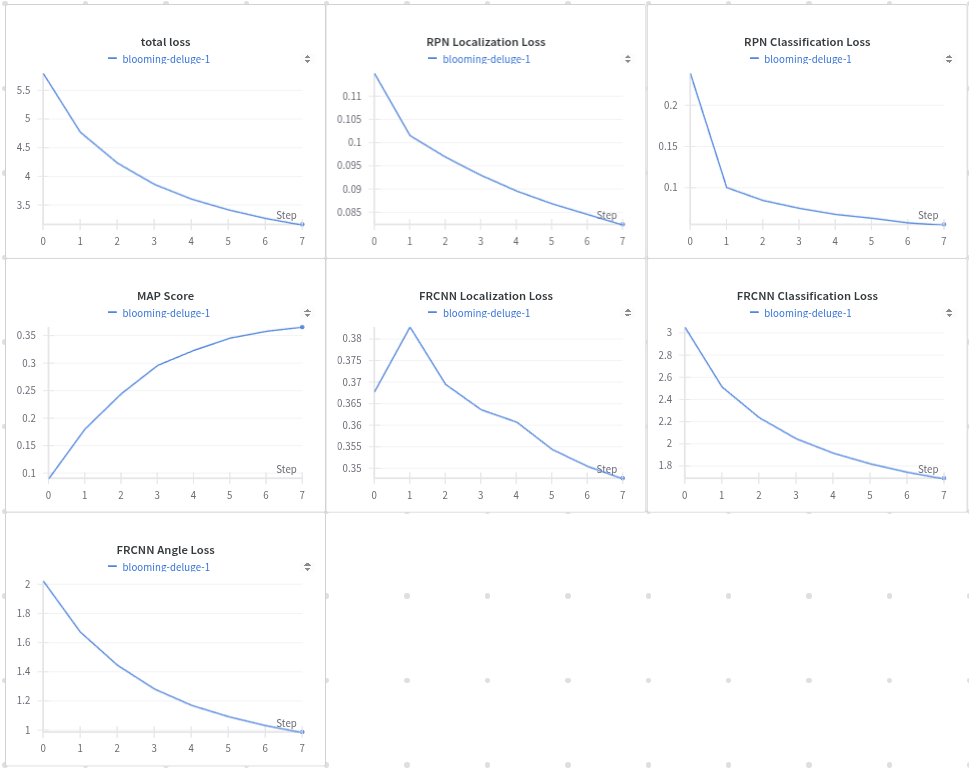
[CSV](hyperparameter_CSV/st_5.csv)

[train_6](train_6.py)
  angle_weight : 10
  angle_binsize : 10
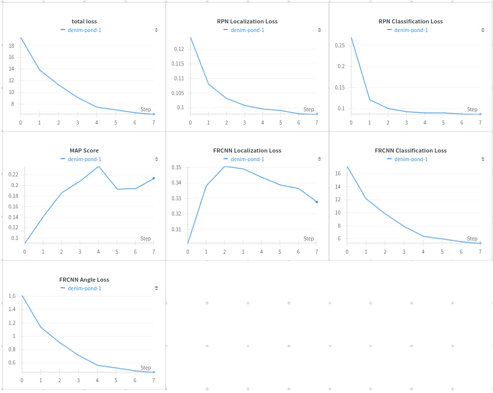
[CSV](hyperparameter_CSV/st_6.csv)

Extended trained 6 plot 
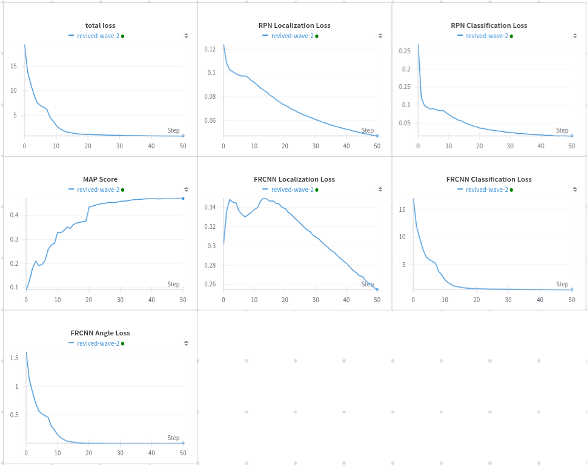

------------
### Analysis of Oriented Bounding Box Detection Results

#### Classification vs Regression
- Classification (discretized angles) significantly outperforms regression across all metrics
    - Classification achieves higher MAP scores (best: 0.37 vs 0.25) with more stable training
    - Classification shows faster convergence and lower overall loss values
    - Regression suffers from high angle loss values that don't translate to better detection

#### Angle Weight Impact

**For Classification:**
- Weight=1 achieves best performance (MAP ~0.37)
- Weight=0.1 performs slightly worse but still well (MAP ~0.35)
- Weight=10 hurts performance substantially (MAP ~0.21)

**For Regression:**
- All weights struggle with unstable training
- Weight=10 catastrophically destabilizes training (starting loss ~65)
- Weight=1 provides best balance but still underperforms classification

#### Loss Patterns
- FRCNN Angle Loss decreases more consistently in classification models
- Higher angle weights amplify initial total loss but don't improve final performance
- Classification models show better balance between all loss components

#### Optimal Configuration
- Classification approach (angle_binsize=10) with angle_weight=1 provides:
    - Highest MAP score (0.37)
    - Good convergence rate
    - Balanced loss components
    - Most stable training progression

-----------

### Try atleast 2 different bin sizes for multi-bin classification for the angle prediction.

[train_6](train_6.py)
  angle_weight : 10
  angle_binsize : 10

#### VS

[train_7](train_7.py)
  angle_weight : 10
  angle_binsize : 2

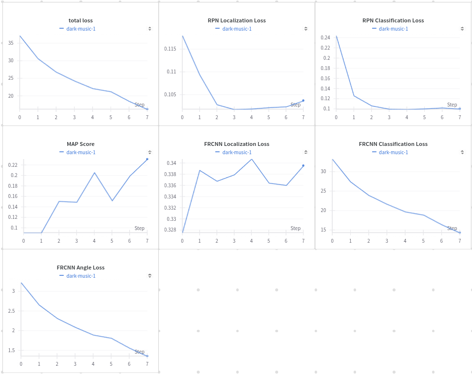
[CSV](hyperparameter_CSV/st_7.csv)

----
### Loss Comparison

#### Initial Total Loss:
- **Bin size 10**: 19.5 (180/10 = 18 angle classes)
- **Bin size 2**: 37.2 (180/2 = 90 angle classes)

#### Final Total Loss (by epoch 8):
- **Bin size 10**: 6.3
- **Bin size 2**: 16.2 (still much higher)

#### FRCNN Classification Loss:
- Consistently higher with bin size 2
    - **Bin size 10**: Reduces from 17.2 to 5.3
    - **Bin size 2**: Reduces from 33.2 to 14.3

#### FRCNN Angle Loss:
- Consistently higher with bin size 2
    - **Bin size 10**: 1.6 → 0.46
    - **Bin size 2**: 3.2 → 1.35

#### MAP Performance

##### Final MAP:
- **Bin size 10**: 0.214
- **Bin size 2**: 0.231 (slightly better)

#### Analysis

- **Class Complexity**: The smaller bin size (2) creates many more angle classes (90 vs 18 bins), resulting in a much more complex classification problem and higher losses.
- **Precision vs Complexity**: The finer angle discretization (2°) offers more precise angle prediction than the coarser discretization (10°), but at the cost of much higher loss values and potentially slower convergence.
- **MAP Improvement**: Despite higher losses, the finer angle discretization eventually achieves slightly better MAP (0.231 vs 0.214), suggesting that the increased angle precision does contribute to better detection performance.
- **Computational Efficiency**: The coarser bin size (10) provides more efficient training with significantly lower losses while still achieving competitive MAP performance.

---------

# 2. Visualize results:
---
## To see all inference images, go to directory of image  

### Model :
###  angle_weight : 10
###  angle_binsize : 0
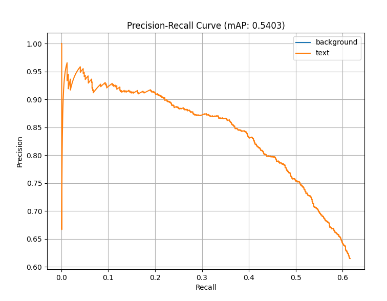 at MAP@0.5
Predicted
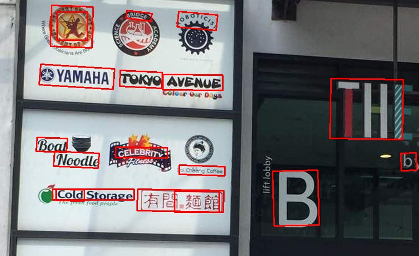
GT
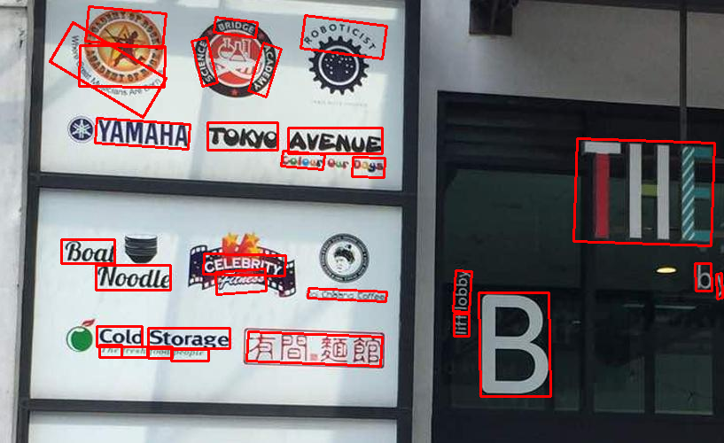

Predicted
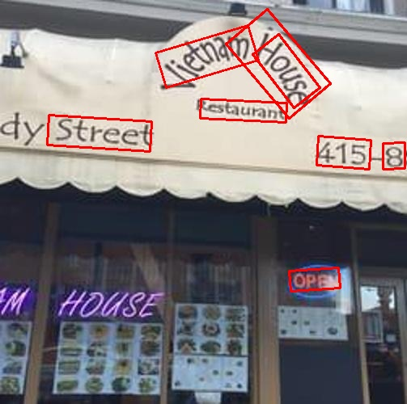
GT
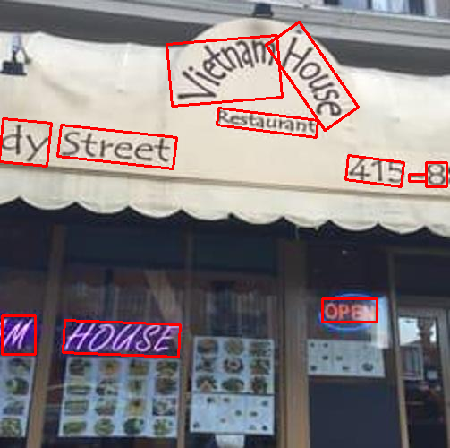

MAP@0.3 = 0.5878\
MAP@0.5 = 0.5403\
MAP@0.7 = 0.2688

---
### Model :
###  angle_weight : 10
###  angle_binsize : 3
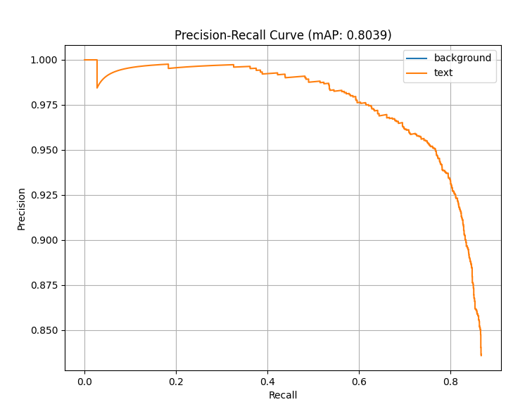 at MAP@0.5
Predicted
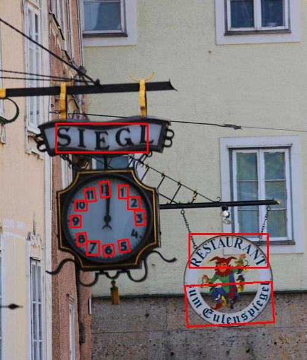
GT

Predicted
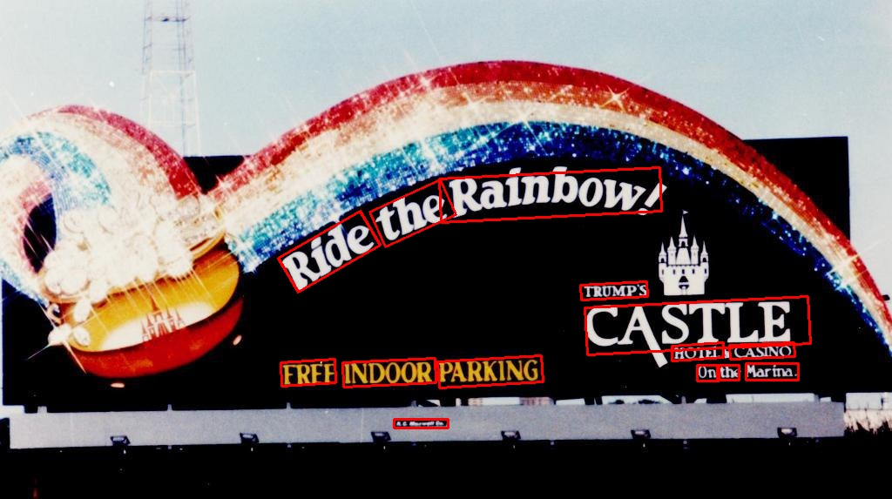
GT

MAP@0.3 = 0.8123\
MAP@0.5 = 0.8039\
MAP@0.7 = 0.6978
---

### Model :
###  angle_weight : 10
###  angle_binsize : 10
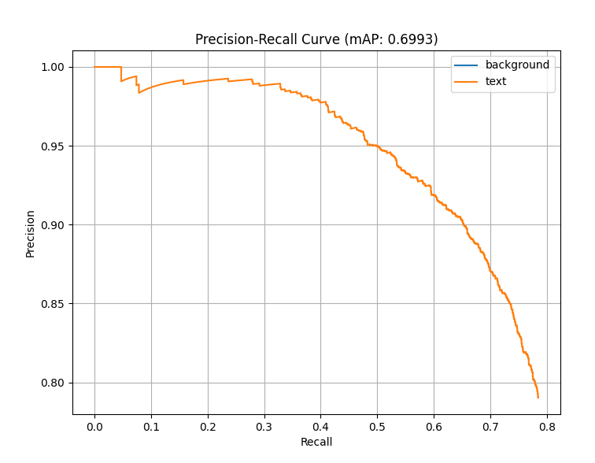 at iou@0.5
Predicted

GT
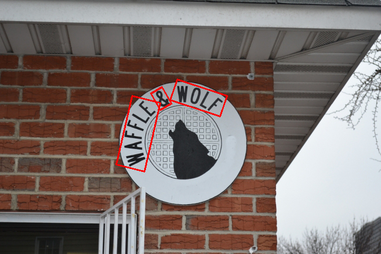

Predicted
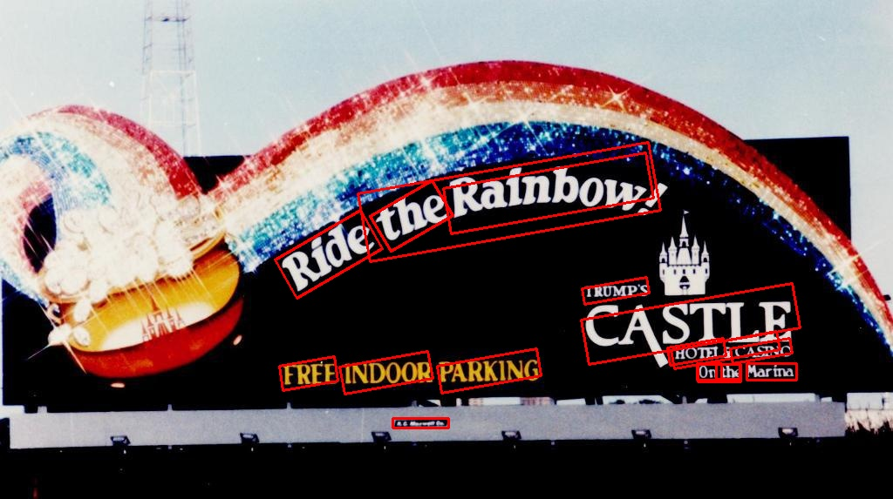
GT
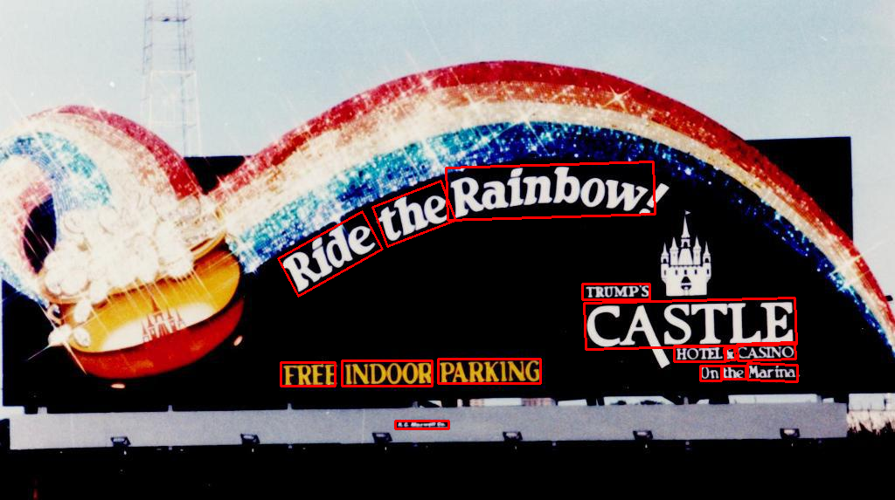
(while bigger bin size gives poor represenation )

MAP@0.3 = 0.7922\
MAP@0.5 = 0.6993\
MAP@0.7 = 0.4645

-------

### Model:  
**angle_weight**: 10  
**angle_binsize**: 0  

- **MAP@0.3** = 0.5878  
- **MAP@0.5** = 0.5403  
- **MAP@0.7** = 0.2688  

#### Key Points:
- Moderate performance with better results at lower IOU thresholds.
- Poor localization and angle prediction, especially at higher IOU values (MAP@0.7).
- Misalignments in predictions suggest limited precision, possibly due to the **angle_binsize of 0**.

---

### Model:  
**angle_weight**: 10  
**angle_binsize**: 3  

- **MAP@0.3** = 0.8123  
- **MAP@0.5** = 0.8039  
- **MAP@0.7** = 0.6978  

#### Key Points:
- Significant improvement across all MAP scores, especially at higher IOU values.
- **angle_binsize of 3** provides better angular resolution, leading to more accurate bounding box predictions.
- Predictions are more precise and better aligned with the ground truth.

---

### Model:  
**angle_weight**: 10  
**angle_binsize**: 10  

- **MAP@0.3** = 0.7922  
- **MAP@0.5** = 0.6993  
- **MAP@0.7** = 0.4645  

#### Key Points:
- Lower performance at higher IOU thresholds compared to the model with **angle_binsize of 3**.
- **angle_binsize of 10** results in poorer angle prediction and less accurate bounding boxes, as seen in the visual comparison.

---

-----

### Analysis continued of Oriented Object Detection Performance

#### Classification vs Regression Angle Prediction
- Classification models significantly outperform regression models in MAP scores and training stability.
- Regression produces redundant overlapping detections due to:
    - Higher uncertainty in continuous angle space
    - Difficulty in modeling angle periodicity
    - Less discriminative confidence scores for similar orientations
- Classification approach provides clearer decision boundaries for angle prediction, resulting in more precise non-overlapping detections.

#### Bin Size Analysis: Bin Size 3 vs Bin Size 10
- **Bin size 3** demonstrates superior visual performance over bin size 10 due to:
    - Higher angular resolution (120° vs 36° per bin) providing finer-grained orientation details
    - Reduced quantization error at bin transitions
    - Better handling of orientation-sensitive objects with subtle angular variations
    - Improved boundary delineation between adjacent objects
    - More accurate representation of orientation-critical features (e.g., elongated objects) 
- Smaller bin size strikes optimal balance between classification complexity and angular precision. 

#### Model Performance Analysis

##### Failure Cases
- Both approaches struggle with:
    - Orientation-ambiguous objects (near-symmetric shapes where multiple angles appear valid)
    - Small objects with insufficient features for reliable angle estimation
    - Dense object clusters where orientations are difficult to resolve individually
    - Extreme angles underrepresented in training data
- Regression specifically fails with inconsistent angle predictions for visually similar instances.

#### Architectural Improvements
- Implement rotated RoI pooling specifically designed for oriented features
- Introduce angle-aware feature alignment in the backbone network
- Develop orientation-sensitive convolutional filters to better capture directional features
- Design specialized NMS algorithms for oriented bounding boxes using rotated IoU
- Implement cascade refinement stages for iterative angle prediction improvement

#### Alternative Enhancement Methods
- Orientation-aware data augmentation with controlled rotational variation
- Adversarial training to improve robustness to orientation variations
- Auxiliary angle consistency losses between nearby detections of the same class
- Feature-level rotation invariance through equivariant neural network designs
- Angular error-weighted sampling to emphasize difficult orientations during training

#### Convergence Behavior
- Classification models exhibit:
    - More stable gradient flow throughout training
    - Faster convergence to optimal detection performance
    - Better balance between localization and orientation errors
    - More consistent MAP score improvements across epochs
- Bin size 3 likely shows better fine-tuning capability in later training stages due to more precise angular targets.
